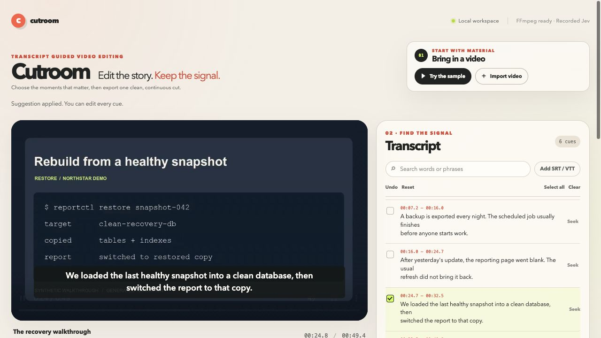

# Cutroom + Business AI Recipes

[](https://github.com/jokv213/business-ai-recipes/actions/workflows/verify.yml)

## Cutroom — edit video by selecting its transcript

**Keep the useful moments. Export the actual video.**

A local video editor with a clickable transcript, selected-only preview, and MP4 + subtitle export. Bring your own video and SRT/VTT. No Python packages or API key needed. Optional Jev suggestions help find moments by meaning.



```bash
git clone https://github.com/jokv213/business-ai-recipes.git
cd business-ai-recipes
python3 tools/cutroom/server.py
```

Requires Python 3.11+ and FFmpeg/ffprobe. Open **http://127.0.0.1:8771/** → **Try the sample** → **Jev suggestion** → **Export selected moments**.

- **Your material:** import MP4/MOV/WebM/MKV and SRT/VTT. Select or remove transcript lines.
- **Instant cut preview:** jump over omitted sections before rendering. Adjust padding and undo selections.
- **Actual deliverables:** H.264/AAC MP4, retimed SRT/VTT, source timeline, and a complete ZIP.
- **Jev is optional:** replay the recorded synthetic demo without a key. Live subtitle suggestions require your own key, explicit launch flag, and consent. Video stays local.

[Quickstart, live setup, measured results, and limits →](tools/cutroom/README.md)

The sample is an authored, narrated simulation. Jev selected the expected 2 of 6 subtitles in a small pre-labelled example; this is not a general performance claim. Cutroom needs existing subtitles and does not transcribe your recording.

## Smaller reproducible recipes

Earlier experiments remain available. They use synthetic data to examine specific boundaries, rather than offering production integrations.

| Recipe | What to try |
|---|---|
| [Evidence-first meeting tasks](RECIPES.md#recipe-1-evidence-first-meeting-tasks) | Source-linked task candidates and a separate review input |
| [Jev meeting-line judgment](recipes/meeting-line-judgment/README.md) | Narrow line classification with abstention |
| [CSV to checked report](recipes/csv-to-report/README.md) | Deterministic CSV reconciliation |
| [Jev support triage](recipes/jev-support-triage/README.md) | Recorded semantic routing examples |
| [CSV exception routing](recipes/jev-csv-exception-routing/README.md) | Comparing keyword rules and recorded decisions |

Run the original offline checks from the repository root:

```bash
python3 -B verify.py
python3 -B run_demo.py
python3 -B recipes/meeting-line-judgment/recipe.py
python3 -B -m unittest discover -s tools/cutroom -p 'test_*.py'
```

Created by **Naoya / jokv213**, with AI-assisted implementation and verification. [Report a reproducible problem or suggest a workflow](https://github.com/jokv213/business-ai-recipes/issues). No adoption, star, or time-saving claims are inferred from the synthetic demonstrations.
