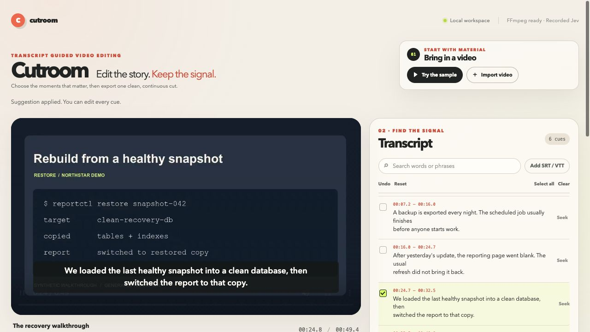

# Dots Studio + Business AI Recipes

[](https://github.com/jokv213/business-ai-recipes/actions/workflows/verify.yml)

## Start with one working path

Choose the shortest route for what you want to try:

- **Make a shareable demo from a running localhost app:** [Demo Forge guide](experiments/demo-forge/README.md) — bring a URL and operation JSON, then export a checked MP4/GIF/cover.
- **Inspect evidence and replay your own input:** [Dots Studio guide](tools/dots-studio/README.md).
- **Turn your own schema into editable plugin source:** [App Forge guide](tools/app-forge/README.md).

## Dots Studio — make assumptions, evidence and failed runs inspectable

Four interactive MCP App workbenches: **Scenario Lab**, **Evidence Canvas**,
**Run Lens / Repair Pack**, and **Proof Pack Builder**. Bring a CSV or JSON, change conditions, select
what to carry forward, and export a replay you can recompute. No API key.


```bash
cd tools/dots-studio
npm ci --ignore-scripts --no-audit --no-fund
npm run build
npm test
npm run preview
```

Requires Node 22+. Open **http://127.0.0.1:8782/scenario?preview=1**.
Local UI and official MCP Client are verified; actual installation and use
inside a dots host are pending. The portable plugin source registers global,
thread and file entrypoints without claiming account installation.

[Try all four panels, replay your own input, and see the verification limits →](tools/dots-studio/README.md)
 · [50 ranked extension experiments →](tools/dots-studio/IDEAS.md)

## App Forge — make a small extension from your own schema

App Forge turns a constrained `fields[]` or JSON Schema `properties{}` input
into an editable local MCP plugin source. Build and test it, edit your own
sample JSON, export the result, and take the source ZIP with you. It is
deterministic and local: it does not call a model or network service and does
not claim installation in an actual dots host.

```bash
cd tools/app-forge
node forge.mjs \
  --schema fixtures/support-request.schema.json \
  --data fixtures/support-request.data.json \
  --out /tmp/app-forge-support
cd /tmp/app-forge-support
npm ci --ignore-scripts --no-audit --no-fund
npm run build
npm test
npm run preview
```

Edit a field at `http://127.0.0.1:8783/?preview=1`, export the JSON, and keep
the generated source ZIP. The generated source is a local development artifact;
host connection, account installation, and external delivery remain separate
steps. [Full App Forge instructions and limits →](tools/app-forge/README.md)

## Demo Forge — turn a working app into a demo people can try

Demo Forge turns a short operation definition into a real browser run against
a self-owned localhost app. It checks the app's final success state and writes
WebM, MP4, GIF, and a cover image. The input is synthetic and the default route
never uses an external API or a logged-in browser profile.

**Already running your app? Record it by URL, with no server modifications.**


Write an operation JSON for your actual selectors and expected outcome, then:

```bash
python3 experiments/demo-forge/forge.py \
  --url http://127.0.0.1:3000/ \
  --operation my-operation.json \
  --output .demo-forge-output/my-app \
  --tail-seconds 8
```

The app keeps running. The runner checks the outcome before converting its real
browser recording. HTTP assets must stay on the same loopback port; redirects,
WebSockets and service workers are unsupported. See the operation JSON example
in the [Demo Forge guide](experiments/demo-forge/README.md).

```bash
python3 -m venv .demo-forge-venv
.demo-forge-venv/bin/python -m pip install playwright
.demo-forge-venv/bin/python -m playwright install chromium
.demo-forge-venv/bin/python experiments/demo-forge/forge.py --doctor
.demo-forge-venv/bin/python experiments/demo-forge/forge.py \
  --output .demo-forge-output \
  --tail-seconds 8
```

`.demo-forge-venv/` and `.demo-forge-output/` are local workspace directories;
they are intentionally ignored by Git and by the repository verifier. The
verifier continues to check the trusted recipe files, so it is safe to run
`python3 -B verify.py` after this setup.

`--doctor` reports `python_environment` and prints the matching repair commands.
If you already have an active virtual environment, use its Python instead.

FFmpeg must also be on `PATH`. The command operates only on `127.0.0.1`,
checks `Ready to share` and `Launch Kit is ready`, and produces a 10-30 second
share preview when `--tail-seconds 8` is used, by holding the verified final
frame in the MP4 and GIF. A shorter tail is useful for a smoke check but makes
a shorter preview. It does not claim generic browser compatibility or a speedup.
[Direct instructions, boundaries,
and the Japanese introduction →](experiments/demo-forge/README.md)

## Cutroom — edit video by selecting its transcript

**Keep the useful moments. Export the actual video.**

A local video editor with a clickable transcript, selected-only preview, and MP4 + subtitle export. Bring your own video and SRT/VTT. No Python packages or API key needed. Optional Jev suggestions help find moments by meaning.



```bash
git clone https://github.com/jokv213/business-ai-recipes.git
cd business-ai-recipes
python3 tools/cutroom/server.py
```

Requires Python 3.11+ and FFmpeg/ffprobe. Open **http://127.0.0.1:8771/** → **Try the sample** → **Jev suggestion** → **Export selected moments**.

- **Your material:** import MP4/MOV/WebM/MKV and SRT/VTT. Select or remove transcript lines.
- **Instant cut preview:** jump over omitted sections before rendering. Adjust padding and undo selections.
- **Actual deliverables:** H.264/AAC MP4, retimed SRT/VTT, source timeline, and a complete ZIP.
- **Jev is optional:** replay the recorded synthetic demo without a key. Live subtitle suggestions require your own key, explicit launch flag, and consent. Video stays local.

[Quickstart, live setup, measured results, and limits →](tools/cutroom/README.md)

The sample is an authored, narrated simulation. Jev selected the expected 2 of 6 subtitles in a small pre-labelled example; this is not a general performance claim. Cutroom needs existing subtitles and does not transcribe your recording.

## Smaller reproducible recipes

Earlier experiments remain available. They use synthetic data to examine specific boundaries, rather than offering production integrations.

| Recipe | What to try |
|---|---|
| [Evidence-first meeting tasks](RECIPES.md#recipe-1-evidence-first-meeting-tasks) | Source-linked task candidates and a separate review input |
| [Jev meeting-line judgment](recipes/meeting-line-judgment/README.md) | Narrow line classification with abstention |
| [CSV to checked report](recipes/csv-to-report/README.md) | Deterministic CSV reconciliation |
| [Jev support triage](recipes/jev-support-triage/README.md) | Recorded semantic routing examples |
| [CSV exception routing](recipes/jev-csv-exception-routing/README.md) | Comparing keyword rules and recorded decisions |

Run the original offline checks from the repository root:

```bash
python3 -B verify.py
python3 -B run_demo.py
python3 -B recipes/meeting-line-judgment/recipe.py
python3 -B -m unittest discover -s tools/cutroom -p 'test_*.py'
```

Created by **Naoya / jokv213**, with AI-assisted implementation and verification. [Report a reproducible problem or suggest a workflow](https://github.com/jokv213/business-ai-recipes/issues). No adoption, star, or time-saving claims are inferred from the synthetic demonstrations.
